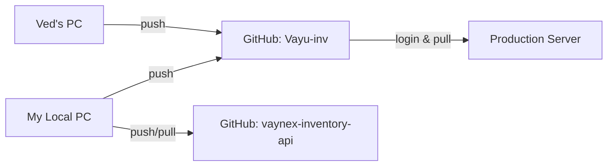

# Git Workflow & Repository Info

This document explains how the code flows from your local machine to the production server (cPanel).

## 1. Repository Structure

Your project is connected to multiple Git repositories (Remotes).

| Remote Name | URL | Purpose |
| :--- | :--- | :--- |
| **origin** | `https://github.com/vayunex-solution/Vayu-inv.git` | **Use for Deployment.** This is Sandeep's repo. cPanel pulls from here. |
| **vayunex** | `https://github.com/vayunex-solution/vaynex-inventory-api.git` | **Official Repo.** This is the Vayunex organization repo. Keep it synced. |
| **upstream** | `https://github.com/vayunex-solution/vaynex-inventory-api.git` | Same as `vayunex`. Used for fetching updates. |

## 2. Data Flow Diagram



## 3. How to Deploy (Standard Process)

### Step 1: Push from Local PC
When you make changes locally:

```bash
# 1. Add changes
git add .

# 2. Commit changes
git commit -m "Description of change"

# 3. Push to 'origin' (Sandeep's repo) for deployment
git push origin main
```

### Step 2: Deployment on cPanel
To update the live server:

1.  Login to cPanel via SSH.
2.  Navigate to the app directory:
    ```bash
    cd ~/repositories/Vayu-inv
    ```
3.  Pull the latest code:
    ```bash
    git pull origin main
    ```
4.  Copy files to the public folder (if using the copy strategy) or just run the build command.
    ```bash
    # Example: Copy API files
    cp -r src ~/inv-api.vayunexsolution.com/
    ```
5.  **Restart the Application** (Important for API changes):
    ```bash
    touch ~/inv-api.vayunexsolution.com/tmp/restart.txt
    ```

## 4. Updates from Other Developers (e.g., Ved)

When Ved or others update the code:

1.  Fetch all updates:
    ```bash
    git fetch --all
    ```
2.  Check for their branch (e.g., `origin/ved`):
    ```bash
    git branch -r
    ```
3.  Merge their updates into your main branch:
    ```bash
    git merge origin/ved
    ```
4.  Push the combined code back to origin:
    ```bash
    git push origin main
    ```
